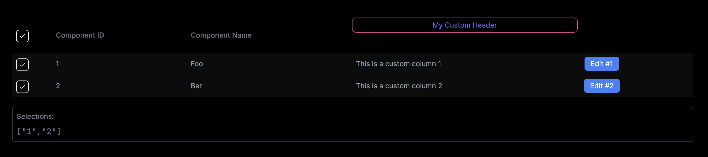

# svelte5-table

Slick & lean Svelte 5 Table Component



## Installation

```bash
npm install @mateothegreat/svelte5-table
```

## Usage

```ts
<script lang="ts">
  import { Table } from "@mateothegreat/svelte5-table";
</script>

{#snippet actionsHeader()}
  <div class="flex items-center gap-2">
    My Custom Header
    <PartyPopper class="h-4 w-4 text-pink-500" />
  </div>
{/snippet}
{#snippet actionsColumn()}
  <div class="flex items-center gap-2">
    <Button variant="outline">Edit</Button>
  </div>
{/snippet}

<Table data={$components} columns={columns} table={{
  header: [
    { field: "id", value: "Component ID" },
    { field: "name", value: "Component Name" },
    { field: "actions", snippet: actionsHeader }
  ],
  columns: [
    { field: "id", header: "Component ID" },
    { field: "name", header: "Component Name" },
    { field: "actions", snippet: actionsColumn }
  ]
}} />
```
